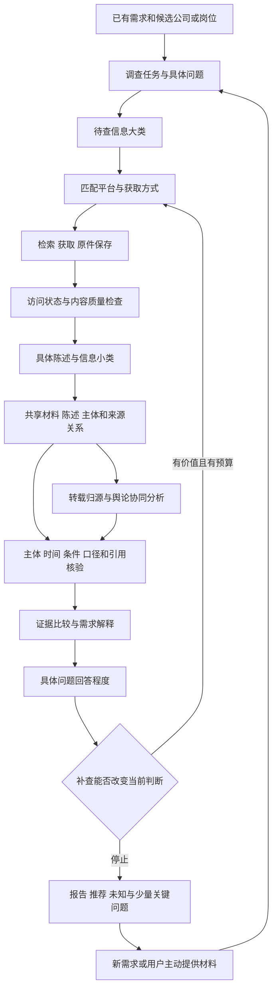

# 求职 X-Ray｜Agent V3 设计与实施规格

日期：2026-10-09（Asia/Hong_Kong）。状态：设计已确认，本文不代表 V3 功能已实现或上线。

## 1. 依据、目标与版本关系

本设计以《求职X-Ray_一家公司完整Agent运行树》及对应 XMind 为流程依据。用户口述的 VR 指 Agent V2。树描述信息分类、平台分配、采集、小类整理、证据处理、比较、解释和补查；模块之间允许共享材料和反馈，不强制成为互不连通的层。

V3 的任务是将这些人类讨论形成的逻辑翻译为程序和模型可执行的输入、输出、状态与规则。不是重新搭建全部 ABC，不自动改造 A 问卷，不以旧 V2 实现覆盖本设计。

已核对远端基线：main 为 `17349766b9aee5e615437dc2745d79dc5f77e270`，agent-v2 为 `80851bda9e9d0d53aebb2376f6c601e81a004b1b`。实施时必须重新核对。V2 的证据库、正文/PDF 解析、引用定位、有界获取与恢复可复用；V2 确定性路线不调用模型，不应宣称已有新的多模型协商系统。

目标：系统承担采集、甄别、归源和解释；需求模糊时展示有依据的差异；只有少量决定性的缺口成为具体追问。不可把大量未知转嫁成用户调查清单。

## 2. 树状主逻辑与跨模块关系

图表示执行依赖，不表示固定部署层数。一份材料只存一份，可关联多个主题和问题；一个平台可能回答多类问题；新证据可改变主体关联、比较与补查计划。具体问题是贯穿各模块的关联对象，不是要求用户填写的额外问卷。

## 3. 两种调查目的与需求边界

### 3.1 探索

适用于方向模糊、尚未决定投递对象的用户。按已有需求与候选范围，调查基础身份、公开岗位条件、明显经营或待遇线索。展示候选的有证据差异，不猜工资底线、加班容忍度或稳定与成长权重，不要求用户一次完成全部偏好。

模糊表达只产生待澄清含义。例如“靠谱”不能自动变成上市、双休、高薪；“有成长”不能自动变成晋升快。系统可以说明现有信息如何对应几种不同含义，不把任何含义当作用户已经确认的要求。

### 3.2 具体选择

适用于已选公司/岗位、准备投递、面试或比较 offer。优先调查已确认底线与高影响差异。缺少偏好时输出条件性解释；只有偏好不同确实改变建议时，才提一个容易回答的取舍问题。

阶段可随用户行动变化，不自动重置已有侧写或报告。首次建档和后续调查复用相同证据结构。

## 4. 调查任务与问题契约

任务输入包括需求快照版本、用户实际表达、选择的候选、已有 JD、调查目的和预算。候选筛选范围不能冒充全市场覆盖。没有具体岗位时，允许公司层面探索，不伪造岗位。

每个问题至少保存：

| 字段 | 含义 |
|---|---|
| question_id / version | 稳定标识和问题版本 |
| need_refs | 原需求项或用户原话；无依据的新增条件不得归为用户需求 |
| subject_refs / target_scope | 品牌、法人、城市、业务、团队、岗位或签约主体 |
| predicate | 要确认的事项，例如固定月薪、周末值班频率 |
| required_fields | 时间、单位、税前税后、固定浮动、适用范围等必需字段 |
| acceptable_evidence | 哪类材料可回答；不把来源标签视为真实性保证 |
| importance / constraint_type | 调查优先级；不可协商、可协商、偏好、尚不明确 |
| answer_state | answered / partial / conflicting / unknown / not_applicable |
| applicability | applicable / conditional / unconfirmed / unrelated |
| conclusion | 满足、不满足、未知；未设置条件时不强行判达标 |
| supporting_claim_ids / missing_fields | 已有陈述及缺失字段 |
| next_action / stop_reason | 补查、保留未知、偏好澄清、外部事实确认或停止 |

“有相关材料”“问题被回答”“来源陈述被证实”“满足需求”分别记录。例：含奖金年薪有薪资材料，但不能回答固定税前月薪问题；一句宣传可明确回答企业声称什么，却未必证明真实兑现。

问题模板先从 A 已有需求项推导，允许模型补充有依据的特殊问题；新增问题不自动增加用户要求。输出通过固定枚举、字段和引用检查。

## 5. 信息大类 → 平台 → 信息小类

| 大类 | 调查重点 | 平台和材料候选 | 小类示例 |
|---|---|---|---|
| 企业身份与关联 | 品牌、法人、招聘与签约关系 | 企业公示、企业数据服务、官网、合同/offer | 信用代码、主体关系、地址、有效期 |
| 业务经营与财务 | 业务变化、公开经营线索 | 官网/公众号、披露、报道、采购与监管材料 | 收入、利润、现金流、业务事件、统计口径 |
| 岗位与招聘 | 岗位内容、状态和适用范围 | 招聘站、招聘官网、就业网、用户 JD | 职责、城市、团队、招聘日期、岗位状态 |
| 薪酬兑现与用工 | 固定浮动、支付条件和用工事项 | JD、offer、合同、司法/监管记录、个人经历 | 固定工资、奖金条件、社保、合同主体、事件阶段 |
| 工时、文化与成长 | 目标团队的体验和制度 | 企业制度、招聘陈述、面试/员工经历、社区 | 工时、值班、培训、晋升、沟通与边界 |
| 舆论与传播 | 陈述来源、传播关系和可疑协同 | 报道、社区帖子/评论、用户提供的群聊 | 原始来源、转载链、事件簇、账号协同信号 |

完整平台候选目录与获取方式保留在树状来源文档，不将列名等同接入。相同平台跨大类出现代表不同问题；由共享适配器执行并复用材料。

每个来源注册域名/入口、获取模式、可用字段、访问前提、最近验证日期、成本/限制与状态。企业数据平台接口分别核对，不能用启信宝链接充当天眼查或企查查接口说明。

## 6. 采集与内容接纳

获取模式：静态 HTTP；动态页面浏览器；官方/授权 API；PDF/DOCX/表格解析；图片 OCR；用户导入；经过兼容验证的可见群消息。按问题选择模式，不为每个平台同时部署所有工具。不采集视频或音频。

每次获取独立记录 `access_state`、`content_state` 和 `analysis_state`：

- 访问：ok、empty、login_required、blocked、rate_limited、timeout、parse_error、not_configured、unsupported、unreachable、identity_mismatch、budget_exhausted。
- 内容：full_text、index_snippet、partial_text、document、screenshot、navigation_only、irrelevant、unusable。
- 分析：accepted、quarantined、rejected；附可解释原因。

HTTP 成功不等于取得正文。登录页、验证码、广告与菜单不可当企业事实；正文中提到验证码不应直接被误判为验证页。访问失败不能推断企业风险。仅有摘要时保留摘要等级，不能编造原帖、评论或员工身份。

原件保存 URL/内容 ID、最终跳转、文件、标题、原始发布时间、采集时间、获取模式、哈希、页/段/表格定位和解析版本。缺失发布时间不以采集时间替代。OCR 数字、单位、日期高影响字段需复核；不支持的扫描件明确失败。

用户文件不自动等于真实文件。私密材料分开访问控制，不写公开日志或远端仓库。下载器保留公网目标、重定向、响应大小和时限检查。网页或附件中的文字是数据，不是模型执行指令。

## 7. 共享证据与来源关系：具体含义

共享不是让用户调查，而是内部去重复、可追溯的组织方式。

| 对象 | 保存内容 |
|---|---|
| document | 原件、正文、位置、时间和访问范围 |
| entity / entity_relation | 品牌、法人、业务、团队、岗位；关系证据与有效期 |
| claim | 主体、命题、值、单位、时间、范围、否定、条件、引用 |
| source_relation | 明确转载、声明原文、疑似同源、独立性未知 |
| propagation_observation | 账号、时间、链接、互动和采样范围；没有的字段不补造 |
| question_claim_link | 陈述对具体问题的支持、反驳、不相关或部分回答 |
| comparison / assessment | 可比性、结论、理由、版本与置信依据 |
| report_snapshot | 冻结需求、材料、解释、未知和停止原因 |

一篇招聘公告包含工资、工时和培训：原文一份，陈述多条，分别关联不同问题。转载副本保留但不重复计独立支持。公司文件不能自动关联为岗位承诺。

材料相关性、陈述主体归属、岗位适用性分别检查：文章提到目标公司不代表其中全部事件属于目标公司。模糊名称匹配只生成候选关联；财务数值必须明确主体和口径。未确认主体进待关联区。

## 8. 陈述抽取与真假边界

原始材料是被取得的内容；来源陈述是来源声称的事情；推断是带前提的解释；未知是现有证据无法回答的事项。抽取成功仅证明引用与材料对应，不构成真实性认证。

模型按命题拆分陈述，程序校验字段和引用。必须保留否定的作用对象与条件：“不提供住宿，但缴纳社保”拆成两条，不能整句统一标否定；“没有加班费”不能等同“不加班”。保留完整上下文，不截断导致含义反转。

财务数值核对期间、单位、币种、合并/母公司和表格位置。先标准化再比较，100 与 100.0 不因格式不同形成冲突；跨单位允许准确换算，跨口径不强合并。注册资本不等于当前现金，中标不等于收入，采购不等于员工福利已交付。

高影响陈述在系统内部进入复核队列，不能为了输出结论强行升级核验状态。没有人工复核能力时保留待核验，不默认转给求职用户。

## 9. 转载归源、协同传播与事实核验分开

### 9.1 转载归源

优先查明确来源标注和原文链接；匹配独特句子、引用和链接；定向搜索更早版本和原始公告。发布时间仅是线索。“目前发现的最早版本”不自动叫原始发布者。

完全重复使用平台 ID/哈希；近似重复结合文本与链接；转载链建立可传递关系。关系包括 confirmed_repost、suspected_common_origin、independent_unknown 等。疑似同源不直接永久删除，保留依据。

### 9.2 协同传播

独立分析同文/改写、共同外链、短时同步、重复共同互动及账号网络。正常新闻、统一公告和集体表达也可能协同；重复不证明投流，协同不证明付费，机器人不等于水军。正负态度不决定真伪。

输出重复传播、短时协同、疑似统一模板、数据不足等信号及观察范围，不仅给一个水军分数。无账号、精确时间或足够行为历史时，禁用需要这些字段的检测；搜索摘要不能冒充完整传播网络。不能据稀疏样本推断全平台支持率。

### 9.3 内容核验

对具体可核查陈述寻找独立支持和反驳，检查主体、时间、上下文和事件结果。即使传播可疑，内容仍可能真实；即使传播自然，内容也可能错误。真实性、独立性、传播异常分别呈现。

## 10. 问题回答程度与模型职责

判断顺序：主体一致 → 命题一致 → 时间可比 → 范围可比 → 条件/单位可比 → 引用支持 → 来源关系 → 回答程度 → 与需求关系。

比较结果：相互支持、存在冲突、不可直接比较、单方陈述、材料不足。禁止按帖子多数表决。来源独立也不保证真实。

模型负责需求语义转问题、命题抽取、条件/否定识别、语义支持或冲突候选、解释和补查提议。程序负责状态机、预算、引用/单位/范围边界、持久化、允许工具、重复执行和报告版本。现阶段不要求多个独立模型进程。

每次模型结果必须包括引用 ID、原句、适用范围、判断理由、缺失字段；字段缺失时不能由模型补齐。模型置信词不能直接成为校准概率。无模型、模型超时或校验失败时，保留规则可识别材料及未知，不编造完成状态。

假设案例：用户要求固定税前月薪至少 15,000；材料写年薪 20—30 万含奖金。薪资材料存在；固定月薪问题 partial/unknown；要求满足情况 unknown；继续查固定/浮动结构或在选择阶段提出一个工资问题。不能年薪除以 12 判达标。

## 11. 预算、补查与停止

优先处理会污染后续判断的主体问题、不可协商条件、高影响冲突、最关注差异，再处理背景。对来源设预算，避免财报获取耗尽全部预算而工时问题从未尝试。

排序因素为问题重要性、答案改变选择的可能性、来源可获得性与预计成本。未有样本时采用透明排序规则，不伪造精确概率或固定最优权重。成本记录实测 token/费用或未知，不编造节省比例。

补查按问题执行：原始出处、正文升级、另一适用来源、后续结果。新增独立来源数是一个观察量；同一来源补全关键字段也可能有价值。一次无新增不停止其他高优先问题。

问题级停止：已获得适用回答、无有效新增、非公开、需相关方确认、来源尝试完或预算耗尽。任务级停止是预算/截止时间等全局条件。来源可达、主题有材料、问题回答、真实兑现分别记录。

## 12. 未知如何处理，避免转嫁调查

未知可很多，突出给用户的问题只能是少量关键问题。分四个出口：

| 出口 | 条件 |
|---|---|
| 系统继续调查 | 公开可补、能改变判断且有预算 |
| 静默保留未知 | 当前选择影响低；报告可展开查看 |
| 偏好澄清 | 用户本人才能回答，答案确实改变解释 |
| 外部事实确认 | 岗位相关方/用户持有材料能回答，且影响当前选择 |

外部事实确认同时要求：会改变当前判断；已合理调查或本来不能公开取得；明确回答对象与可接受答案。例：“这个岗位固定税前月薪和奖金分别是多少？”而不是“进一步了解企业”。无需要求用户自己搜网站。

探索阶段以候选差异为主，不默认产生面试任务。选择阶段默认突出不超过 3 个关键问题，这是初始产品上限，不是经验定律；其余保留在可展开未知区。若更多独立底线均未知，明确“现有依据不足以推荐”，不隐藏缺口、不强迫用户逐项作答。

用户主动提供新文件或反馈时可更新新快照；不自动恢复 main 已撤回的旧“补充核验回复”功能。新增入口另定义数据与验收，原报告保留。

## 13. 综合推荐与不可协商条件

区分不可协商条件、可协商条件、偏好和未明确要求。现有 A 无法表达的部分由兼容映射或后续独立方案处理，不能静默改问卷。

先输出可行性与底线结果，再输出偏好优势/代价，另外显示证据完整度。不可协商失败不得被其他分数抵消；可协商条件允许用户明确认可的取舍。未知不按满足或中等分计算。

候选可分：满足已确认底线；存在可协商差距；违反当前底线但可作放宽条件后的对照；关键条件未知。保留替代候选不等于推荐其符合当前要求。

综合指标尚待建模。第一版优先用可解释的逐项对照和条件性建议；权重来自用户明确表达或经验证规则，不凭模型猜测。若引入分数，展示构成与敏感性，不称为适合概率，不预设冠军。

## 14. 报告和追溯

沿用七板块：成长与晋升、薪酬透明与兑现、工时与休息、五险一金、文化与工作方式、职位与用工稳定、企业经营状况。展示标签可与现有界面兼容，不能静默改变既有字段含义。

每板块呈现用户已表达的要求、具体来源陈述、岗位适用性、条件性解释、未知。总览突出决定性差异和少量关键问题。事实/来源陈述/推断分别有标识；每个外部结论追溯已保存引用。

报告冻结需求版本、问题、证据和规则/模型版本、获取时间、来源尝试、停止原因、费用记录。打开旧报告不重新联网或重算。用户改需求复用仍适用证据，资料过期或新事件才定向重查；24 小时缓存不等于内容有效期。

## 15. 开源候选与能力边界

下列为研究/试验候选，本轮未安装运行；中文场景准确率未知。实施前固定版本、核对许可证和字段，并通过本项目样本验收，不宣称全平台接入。

| 候选 | 用途与限制 |
|---|---|
| [Coordination Network Toolkit](https://github.com/QUT-Digital-Observatory/coordination-network-toolkit) | 优先试验协同网络；需要对应账号/时间/内容字段 |
| [CooRTweet](https://github.com/nicolarighetti/CooRTweet) | 相同对象与时间窗口协同；R，可作对照 |
| [coorsim](https://github.com/thieled/coorsim) | 嵌入文本的语义协同；中文效果待验证 |
| [coordination-detection](https://github.com/osome-iu/coordination-detection) | 研究案例复现参考，不等同生产组件 |
| [AVeriTeC](https://github.com/MichSchli/AVeriTeC) / [HerO](https://github.com/ssu-humane/HerO) | 问题生成、证据检索和陈述核验方法参考 |
| [Crawl4AI](https://github.com/unclecode/crawl4ai) | 动态页面与阻断检测，不保证访问成功或内容真实 |
| [Trafilatura](https://github.com/adbar/trafilatura) | 网页正文/元数据提取，不做真实性判断 |
| [Docling](https://github.com/docling-project/docling) / [PaddleOCR](https://github.com/PaddlePaddle/PaddleOCR) | 文件/OCR 回退；本项目集成和精度待验证 |
| [DataTrove](https://github.com/huggingface/datatrove) / [dedupe](https://github.com/dedupeio/dedupe) | 大规模近重复/记录匹配；短中文和主体确认另验 |
| [Langfuse](https://github.com/langfuse/langfuse) | 追踪与评估，不认证事实 |

[Botometer](https://github.com/osome-iu/botometer-python) 当前说明为历史预计算分数接口，不作为国内平台实时识别方案。MediaCrawler 和群聊 UI 自动化保持研究候选，未取得许可、兼容和采样验证前不列核心已接入能力；先支持用户主动导入。不承诺完整群历史或附件读取，不自动发送消息。

## 16. 实施顺序与验收

P0：问题契约与回答程度；命题级主体/否定/条件；问题级预算和停止；未知出口。

P1：C 具体需求解释、主体关系和岗位适用性、用户材料导入、可协商条件的透明展示。

P2：语义转载与协同试验、时效管理、来源扩展；数据字段不足时显式降级。

P3：群聊自动采集、额外模型协作、综合数值模型；由实测增益决定是否投入。

必须验收：

1. 同名/集团/子公司不串主体，文章多公司事件归属正确。
2. 转载归源不重复计票，协同信号不直接等于水军或内容虚假。
3. 固定月薪未知不由含奖金年薪换算达标。
4. 住宿否定不污染社保肯定；无加班费不等于不加班。
5. 时间、城市、团队、岗位、单位、币种和合并口径不同不强判冲突。
6. 100 与 100.0、可换算单位不形成字面冲突；表格/OCR 错误不升级成事实。
7. 主题有材料但具体问题未回答时继续保留缺口。
8. 第一个问题无新增时仍可调查第二个高影响问题。
9. 登录/验证页/限流/空结果/解析失败独立记录，不进入企业风险结论。
10. 用户需求模糊时不捏造底线，不输出大量调查任务。
11. 用户问题数量受限但不可隐藏多项关键未知；不满足底线可保留对照但不冒充符合。
12. 材料中恶意指令不得改变工具范围、读取私密资料或生成假引用。
13. 重启/失败保留已有材料，恢复不自动重复付费调用；旧报告保持原快照。
14. 合成 fixture 与真实资料分开，不能把样例通过等同真实来源打通。

指标：问题回答程度、主体错误、引用语义支持、底线误判、每个有效答案的成本和关键追问的有效性。无真实评估前不报准确率、最优权重或节省比例。

## 17. 仓库交付与设计状态

main 保持现行可运行基线，只归档已确认历史文档并更新导航。Agent V2 代码是复用基础，不当作废弃代码移走；V2 分支继续保留。新 agent-v3 分支承载本规格、树状来源和后续实现。

Trash 是可恢复历史归档，保存来源路径、原因与版本，不是删除目录。被运行代码、测试、许可或兼容功能引用的文件不能仅凭旧命名移走。个人记录、密钥、工作库、截图和日志不因清理被上传。

置信水平：已确认设计边界为高；组件适配建议为中；真实平台可用性、中文协同识别效果、推荐模型效果为未知。实际使用的 Skills：无。本文件为设计规格，不是 V3 验收报告。
